# mosaic-examples

Database-backed plots built with Mosaic, vgplot, and a fully local DuckDB-WASM bundle. The primary output is twelve background-transparent PNGs; the browser views are an optional interactive companion.

```bash
npm install
npm run build
npm run render   # out/*-transparent.png
npm test         # plus offline and pointer-interaction checks
```

Scenes cover large point density, dense signals, distributions, regression, cohorts, matrices, rankings, anomalies, vectors, small multiples, and SQL-linked brushing. All data is deterministic and synthetic. Runtime external requests are blocked by the validator.

## Transparent PNG reference gallery

`catalog.json` records the intended analytical question and visual family for every scene.

| Density | Signals | Linked views | Distributions |
|---|---|---|---|
| 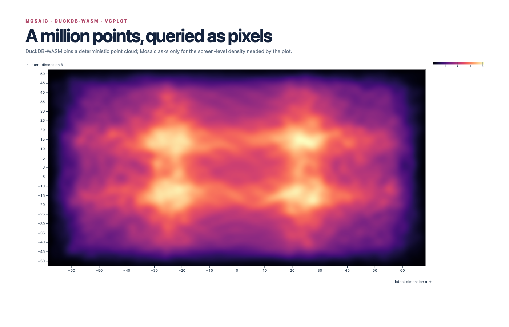 | 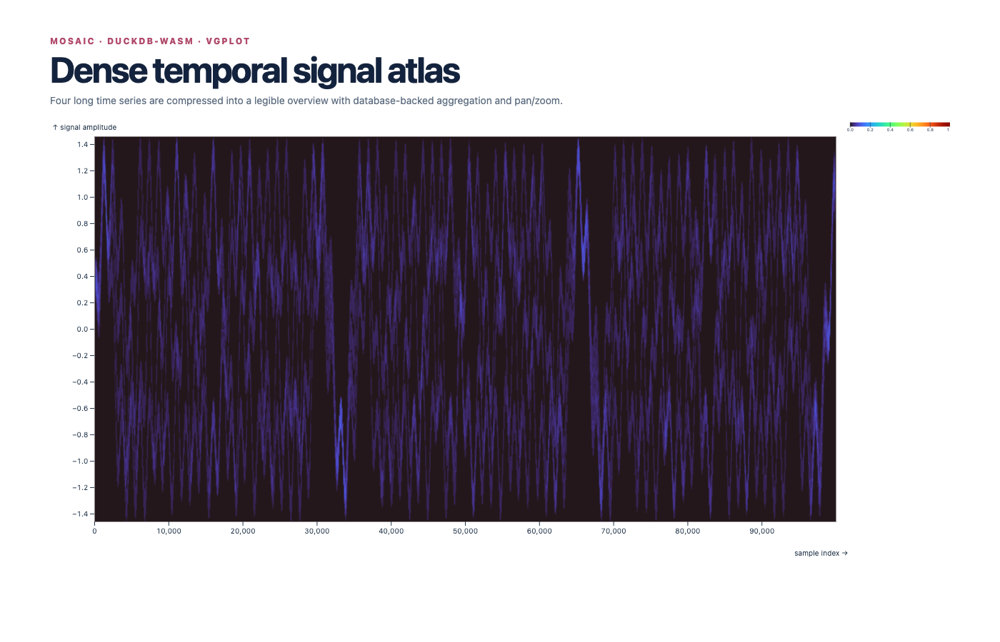 | 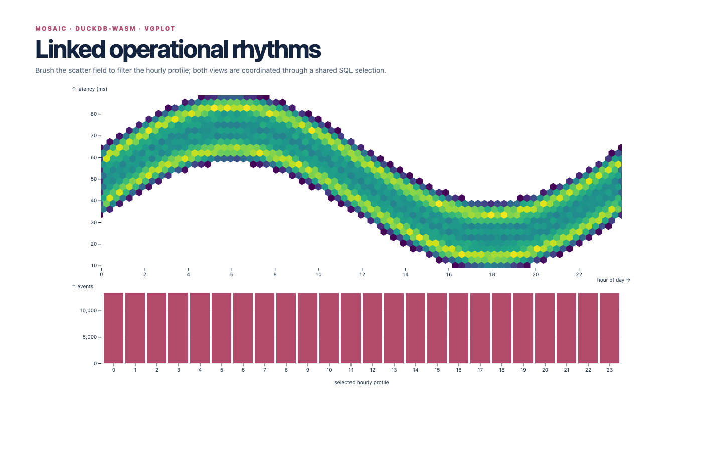 | 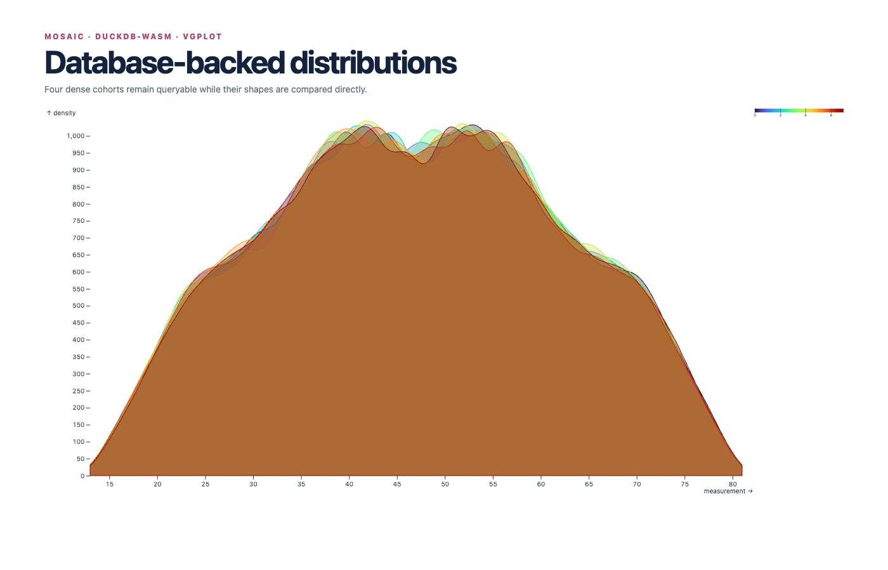 |
| Regression | Retention | Quality matrix | Rankings |
| 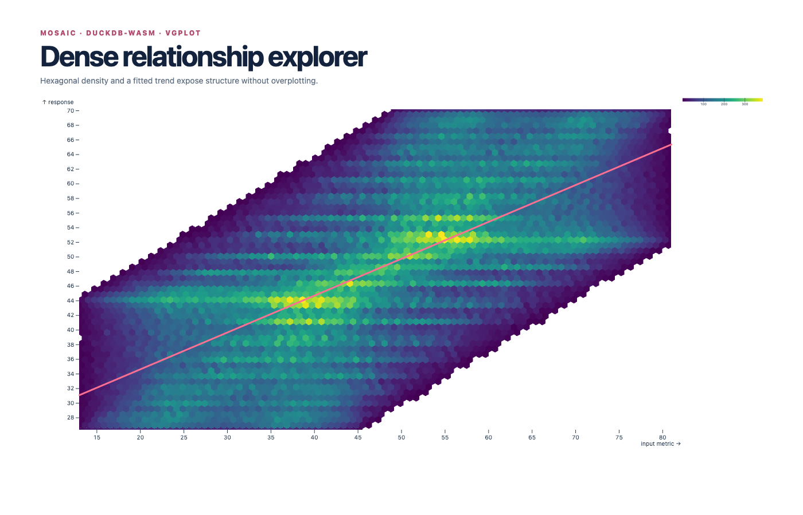 | 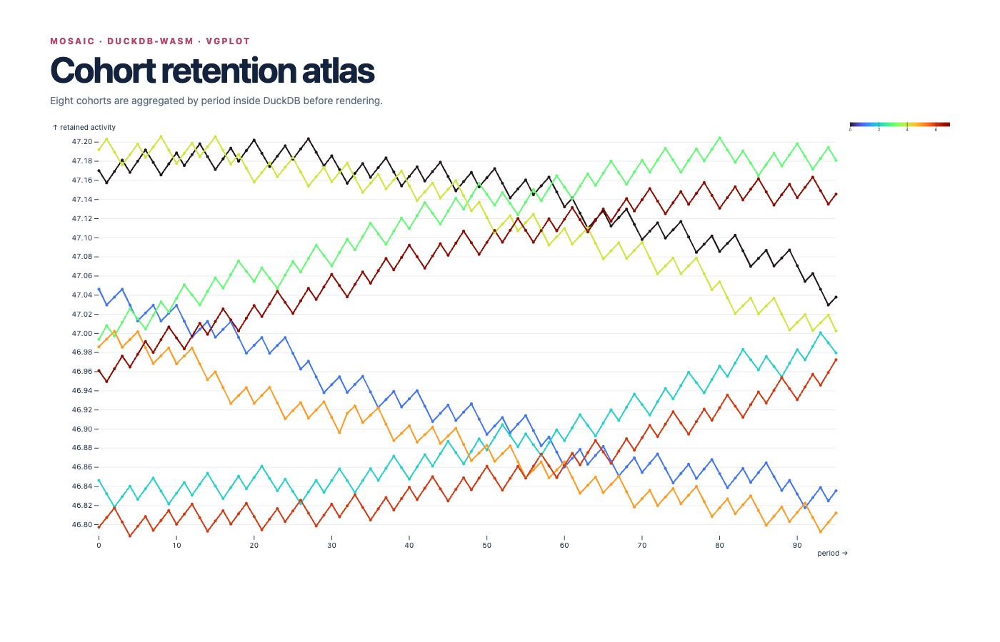 | 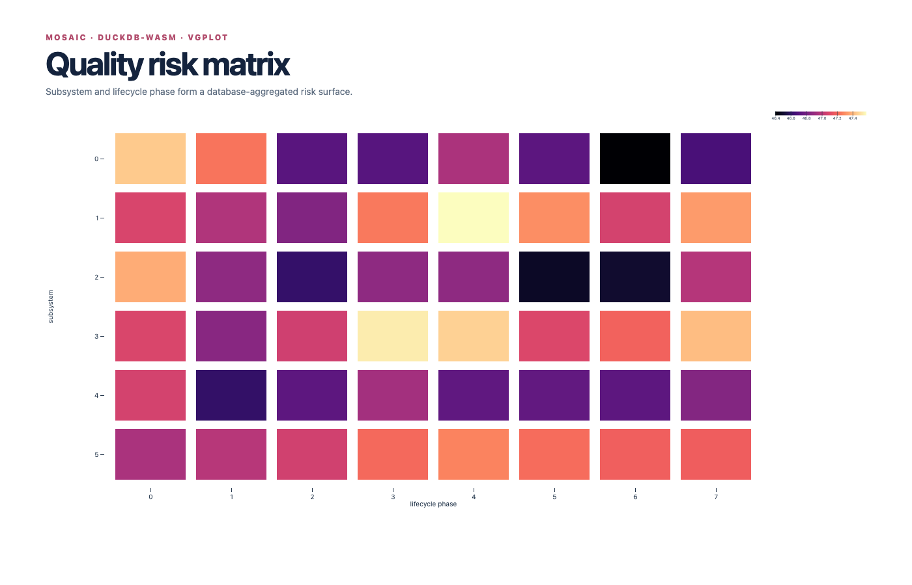 | 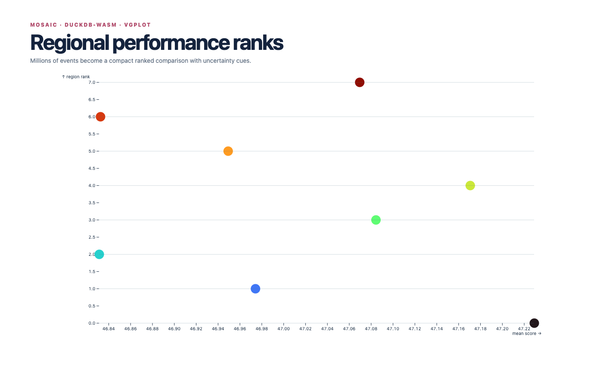 |
| Anomalies | Vector field | Small multiples | Operations |
| 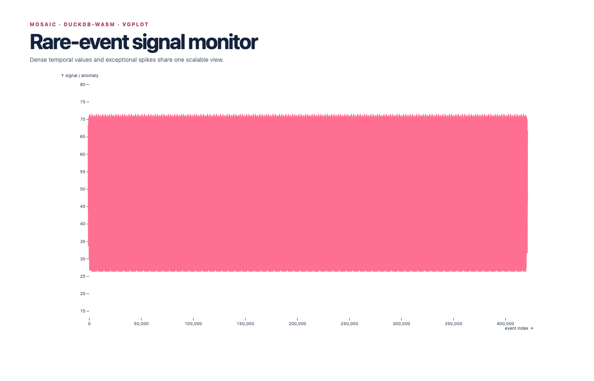 | 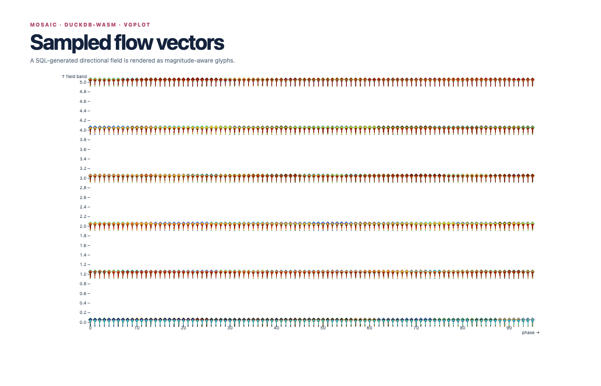 | 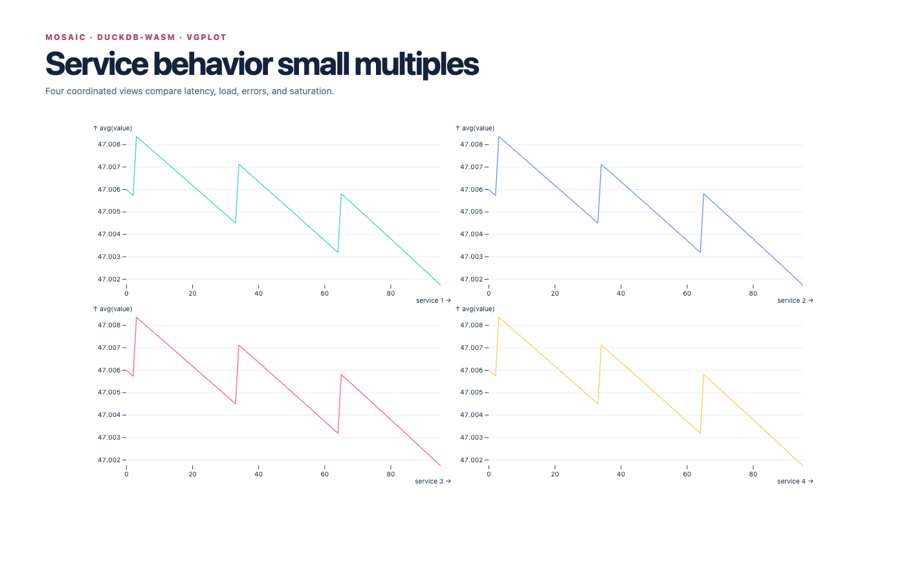 | 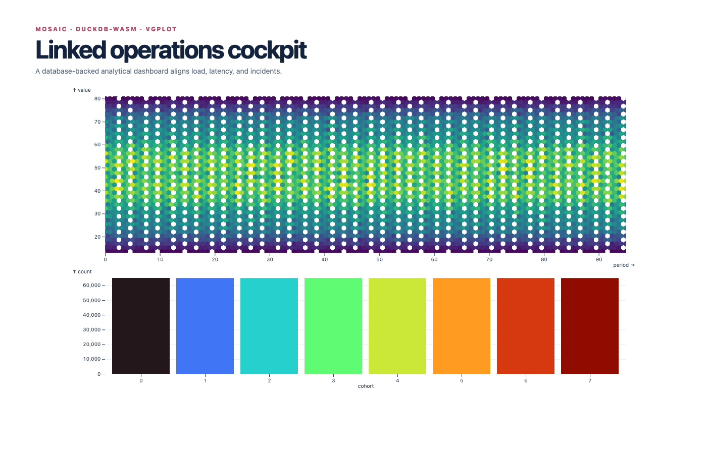 |
